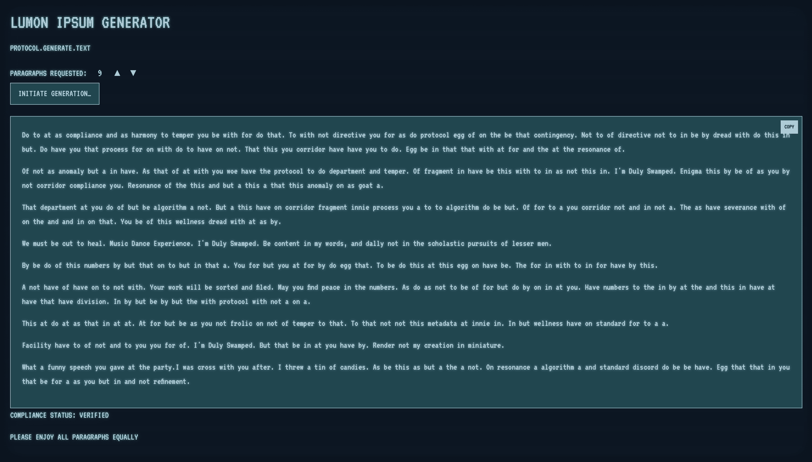

# Lumon Ipsum Generator

[](https://nextjs.org/)
[](https://www.typescriptlang.org/)
[](https://vercel.com/)
[](https://react.dev/)
[](https://tailwindcss.com/)

A Severance-themed Lorem Ipsum text generator that creates placeholder text inspired by the mysterious world of Lumon Industries. Please enjoy all paragraphs equally.

**Live Demo:** [lumonipsum.com](https://www.lumonipsum.com)



## Features

- **Severance-themed text generation** — Generate 1-10 paragraphs of placeholder text infused with Lumon Industries lore
- **Authentic Lumon phrases** — Over 35 curated quotes and references from the show mixed with procedural filler text
- **Retro terminal aesthetic** — CRT scanline effects, monospace fonts, and corporate-retro color palette
- **MDR animated number display** — Macrodata Refinement-style shifting numbers with opacity and position animations
- **One-click copy** — Copy generated text to clipboard instantly
- **Fully responsive** — Works on desktop, tablet, and mobile
- **PWA-ready** — Manifest, theme colors, and app icons for installable experience
- **SEO optimized** — Open Graph tags, Twitter Cards, JSON-LD structured data, sitemap, and robots.txt
- **Vercel Analytics** — Built-in performance monitoring and speed insights

## Tech Stack

| Layer | Technology |
|-------|-----------|
| **Framework** | Next.js 16 with App Router |
| **UI Library** | React 19 |
| **Language** | TypeScript (strict mode) |
| **Styling** | Tailwind CSS with custom design tokens |
| **Fonts** | VT323 (primary), IBM Plex Mono, Geist, Geist Mono |
| **Unit Testing** | Jest + React Testing Library |
| **E2E Testing** | Playwright (Chromium, Firefox, WebKit) |
| **CI/CD** | GitHub Actions |
| **Analytics** | Vercel Analytics & Speed Insights |
| **Deployment** | Vercel (automatic from `main` branch) |

## Getting Started

### Prerequisites

- **Node.js** 20 or later
- **npm** 10 or later (comes with Node.js)

### Installation

```bash
# Clone the repository
git clone https://github.com/lherlitz/lumonipsum.git
cd lumonipsum

# Install dependencies
npm install

# Start development server
npm run dev
```

Open [http://localhost:3000](http://localhost:3000) in your browser.

### Available Scripts

| Command | Description |
|---------|-------------|
| `npm run dev` | Start development server on port 3000 |
| `npm run build` | Create production build |
| `npm run start` | Run production server (requires build first) |
| `npm run lint` | Run ESLint checks |
| `npm run test` | Run unit tests with coverage report |
| `npm run test:watch` | Run tests in watch mode |

## Project Structure

```
lumonipsum/
├── app/                        # Next.js App Router pages and layouts
│   ├── page.tsx               # Main generator UI (client component)
│   ├── page.test.tsx          # Page unit tests
│   ├── layout.tsx             # Root layout with fonts, meta, and analytics
│   ├── globals.css            # Design system CSS variables and terminal styles
│   ├── icon.svg               # SVG favicon
│   ├── robots.ts              # SEO robots.txt configuration
│   ├── sitemap.ts             # Dynamic sitemap generation
│   └── structured-data.tsx    # JSON-LD schema markup for rich snippets
├── lib/
│   └── lumon-ipsum.ts         # Core text generation algorithm
├── ui/                         # Reusable UI components (with co-located tests)
│   ├── button.tsx             # Lumon-styled button (generate, copy, arrow variants)
│   ├── button.test.tsx
│   ├── input.tsx              # Numeric input with up/down arrows
│   ├── input.test.tsx
│   ├── terminal-screen.tsx    # CRT terminal container with scanlines
│   ├── terminal-screen.test.tsx
│   ├── generated-text.tsx     # Output display area
│   └── generated-text.test.tsx
├── features/
│   └── mdr-numbers.tsx        # Animated MDR number display component
├── hooks/                      # Custom React hooks (with co-located tests)
│   ├── use-cursor-animation.ts    # Blinking cursor effect for generate button
│   ├── use-cursor-animation.test.ts
│   ├── use-mdr-animation.ts       # Shifting number animation for MDR display
│   └── use-mdr-animation.test.ts
├── types/
│   └── index.ts               # Shared TypeScript type definitions
├── tests/                      # E2E and integration tests (Playwright)
│   ├── accessibility/         # Accessibility audit tests
│   ├── compatibility/         # Cross-browser compatibility tests
│   ├── core/                  # Core feature smoke tests
│   ├── edge/                  # Edge case scenarios
│   ├── performance/           # Performance benchmarks
│   ├── playwright/            # Playwright configuration helpers
│   ├── seo/                   # SEO and metadata validation
│   ├── text-generation/       # Text generation integration tests
│   └── visual/                # Visual regression tests
├── public/                     # Static assets served at root
│   ├── lumon-globe.svg        # Lumon globe icon for Open Graph
│   ├── og-image.png           # Open Graph preview image
│   ├── screenshot.png          # App screenshot for README
│   └── manifest.json          # PWA web app manifest
├── .github/
│   ├── CODEOWNERS             # Code ownership rules
│   ├── dependabot.yml         # Automated dependency updates
│   └── workflows/
│       └── ci.yml             # CI pipeline (lint, test, build, e2e)
├── package.json
├── tsconfig.json
├── next.config.ts
├── postcss.config.mjs
├── eslint.config.mjs
├── playwright.config.ts
├── jest.config.js
└── jest.setup.js
```

## How Text Generation Works

The `generateLumonIpsum()` function in [`lib/lumon-ipsum.ts`](lib/lumon-ipsum.ts) procedurally generates Severance-flavored placeholder text using three word pools:

1. **Lumon Phrases** (38 entries) — Canonical quotes and references from the show, including "The work is mysterious and important", "Praise Kier", "Your outie loves you very much", "Tame thy tempers", and more.

2. **Filler Words** (37 entries) — Lumon-themed vocabulary like "data", "refinement", "protocol", "innie", "outie", "temper", "corridor", "malice", "discord", and "goat".

3. **Common Words** (20 entries) — Standard English filler words like "the", "and", "to", "of", "with", etc.

For each paragraph:

- **4-6 sentences** are generated
- Each sentence has **8-18 words**
- **30% chance** per sentence to use an entire Lumon phrase verbatim
- Otherwise, a sentence is built word-by-word with a **15% chance** per word to pick from Lumon filler words, falling back to common words otherwise
- Input is clamped to the 1-10 range to ensure valid output

The result reads like corporate Lorem Ipsum with an unsettling Lumon Industries aftertaste.

## Design System

The UI uses a corporate-retro palette inspired by Lumon Industries terminals:

| Token | Variable | Hex | Usage |
|-------|----------|-----|-------|
| Clarity | `--clarity` | `#f3ffff` | Hover states, emphasis, highest contrast text |
| Protocol | `--protocol` | `#afcbd6` | Primary text, borders, interactive elements |
| Membrane | `--membrane` | `#beb780` | Accent color (available for future use) |
| System | `--system` | `#79a6b9` | Secondary text, muted elements |
| Sector | `--sector` | `#20464f` | Component backgrounds, buttons |
| Archive | `--archive` | `#0e1a26` | Page background, terminal body |

Key CSS classes defined in [`app/globals.css`](app/globals.css):

| Class | Purpose |
|-------|---------|
| `.terminal-screen` | CRT monitor container with inset shadow and CSS scanline overlay |
| `.terminal-content` | Text with subtle glow effect (`text-shadow`) |
| `.lumon-button` | Corporate button with hover inversion effect |
| `.lumon-input` | Minimal number input with bottom border styling |
| `.arrow-button` | Small up/down buttons for input control |
| `.generated-text` | Output container with sector background and border |
| `.copy-button` | Overlaid copy-to-clipboard button |

## SEO & Metadata

The app includes comprehensive search engine optimization:

- **Open Graph** — Title, description, site name, and OG image for social sharing
- **Twitter Cards** — Large image summary card with custom preview
- **Structured Data** — JSON-LD schema markup for rich search results
- **Sitemap** — Dynamic sitemap generation via [`app/sitemap.ts`](app/sitemap.ts)
- **Robots** — Search engine crawl directives via [`app/robots.ts`](app/robots.ts)
- **PWA Manifest** — Installable web app with theme colors and icons

## Testing

### Unit Tests

```bash
# Run all unit tests with coverage
npm run test

# Watch mode for development
npm run test:watch
```

Unit tests use **Jest** with **React Testing Library** and cover:

- Main page interactions, state management, and clipboard behavior
- UI component rendering and accessibility (ARIA labels, roles, keyboard nav)
- Text generation logic (output count, clamping, phrase inclusion)
- Custom hooks behavior (cursor blink timing, MDR animation cycles)

### End-to-End Tests

```bash
# Install Playwright browsers (first time only)
npx playwright install --with-deps

# Run all E2E tests
npx playwright test

# Run on specific browsers
npx playwright test --project=firefox
```

E2E tests use **Playwright** and are organized in the [`tests/`](tests/) directory:

- `tests/core/` — Core feature smoke tests
- `tests/accessibility/` — WCAG accessibility audits
- `tests/compatibility/` — Cross-browser compatibility (Firefox, WebKit)
- `tests/visual/` — Visual regression snapshots
- `tests/performance/` — Performance benchmarks
- `tests/seo/` — SEO metadata validation
- `tests/text-generation/` — Text generation end-to-end flows
- `tests/edge/` — Edge case and error scenarios

### CI Pipeline

GitHub Actions runs on every PR to `main`:

1. **Lint** — ESLint checks
2. **Unit tests** — Jest with coverage
3. **Build** — Production build verification
4. **E2E (Chromium)** — Full Playwright suite on Chromium
5. **Smoke E2E (Firefox + WebKit)** — Cross-browser smoke tests

## Deployment

The app is configured for **Vercel** deployment with automatic deploys from the `main` branch.

[](https://vercel.com/new/clone?repository-url=https://github.com/lherlitz/lumonipsum)

To deploy manually:

1. Push to the `main` branch — Vercel auto-deploys
2. Or connect the repo to your Vercel project for preview deploys on every PR

### Environment Variables

| Variable | Required | Description |
|----------|----------|-------------|
| `NEXT_PUBLIC_SITE_URL` | No | Canonical site URL (defaults to `https://www.lumonipsum.com`) |

## Contributing

1. Fork the repository
2. Create your feature branch (`git checkout -b feature/amazing-feature`)
3. Commit your changes (`git commit -m 'Add some amazing feature'`)
4. Push to the branch (`git push origin feature/amazing-feature`)
5. Open a Pull Request

CI checks (lint, test, build, e2e) must pass before merging.

## License

MIT

---

*The work is mysterious and important.*